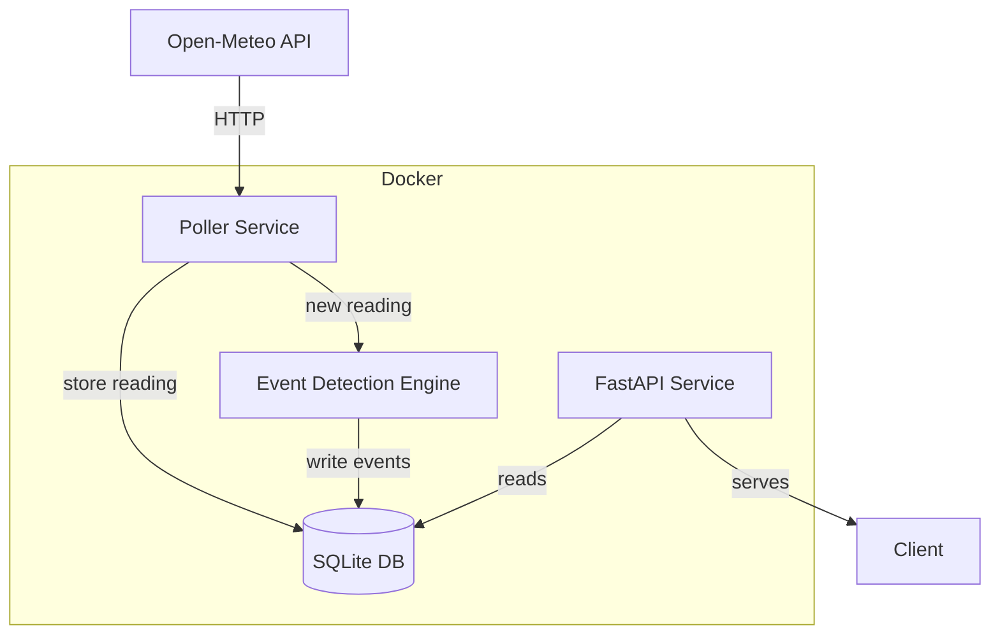

# WatchAgent Weather Monitor


A production-quality service that polls live weather conditions for Ottawa, Toronto, and Vancouver every hour, deduplicates readings, runs a multi-detector event detection engine calibrated to each city's climate, and exposes readings and events over HTTP.

---

## System Overview

Three components share a single SQLite database via a named Docker volume:

- **Poller** — fetches current conditions from Open-Meteo, stores only new `(city, timestamp)` readings (deduplicated via a unique constraint), then immediately triggers the event detection engine.
- **Event Detection Engine** — eight detectors in `app/detectors/`, each in its own module with its own trigger logic, city-specific thresholds, cooldown, and severity score. Runs inside the poller's write transaction.
- **API** — FastAPI service exposing `/health`, `/readings`, `/events`, `/stats`, and a live dark-mode dashboard at `/`.

---

## Architecture

### ASCII (terminal-friendly)

```
┌──────────────────────────────────────────────────────────────────────┐
│                          Docker Compose                              │
│                                                                      │
│  ┌────────────────┐  HTTP/JSON  ┌──────────────────────────────────┐ │
│  │  Open-Meteo    │ ──────────▶ │        Poller Service            │ │
│  │  (free, no     │             │  httpx + exponential backoff     │ │
│  │   auth needed) │             │  SIGTERM graceful shutdown       │ │
│  └────────────────┘             └──────────────┬───────────────────┘ │
│                                                │ new reading         │
│                                                ▼                     │
│                                 ┌──────────────────────────────────┐ │
│                                 │     Event Detection Engine       │ │
│                                 │                                  │ │
│                                 │  TemperatureAnomalyDetector      │ │
│                                 │  RapidChangeDetector             │ │
│                                 │  CompoundStormDetector           │ │
│                                 │  WeatherCodeTransitionDetector   │ │
│                                 │  SustainedHeatSpellDetector      │ │
│                                 │  SustainedColdSpellDetector      │ │
│                                 │  PrecipitationSurgeDetector      │ │
│                                 │  NationalContrastDetector        │ │
│                                 └──────────────┬───────────────────┘ │
│                                                │ readings + events   │
│                                                ▼                     │
│                                 ┌──────────────────────────────────┐ │
│                                 │        SQLite Database           │ │
│                                 │     (Docker named volume,        │ │
│                                 │      persists across restarts)   │ │
│                                 └──────────────┬───────────────────┘ │
│                                                │ reads               │
│                                                ▼                     │
│  ┌────────────────┐   HTTP    ┌───────────────────────────────────┐  │
│  │     Client     │ ◀──────── │         FastAPI Service           │  │
│  └────────────────┘           │  /health /readings /events /stats │  │
│                               └───────────────────────────────────┘  │
└──────────────────────────────────────────────────────────────────────┘
```

### Mermaid (GitHub web view)



---

## Setup

```bash
git clone https://github.com/adithyalee/WatchAgent-Weather-Monitor.git
cd WatchAgent-Weather-Monitor
cp .env.example .env
docker compose up --build
```

API available at `http://localhost:8000`. Dashboard at `http://localhost:8000/`. The poller starts after the API passes its health check, then begins collecting readings immediately.

---

## API Reference

### `GET /health`

```bash
curl http://localhost:8000/health
```

```json
{
  "status": "ok",
  "readings_stored": 42,
  "events_stored": 7,
  "last_poll": "2026-05-27T14:00:00Z",
  "db_size_bytes": 131072
}
```

### `GET /readings`

```bash
curl "http://localhost:8000/readings?city=Vancouver&limit=10"
curl "http://localhost:8000/readings?since=2026-05-26T00:00:00Z&until=2026-05-27T00:00:00Z"
curl "http://localhost:8000/readings?city=Ottawa&limit=10&offset=20"
```

Returns `{ "readings": [ ... ] }` most recent first. Query params:

| Param | Default | Description |
|---|---|---|
| `city` | — | Filter to one city |
| `limit` | 50 | Max results (1–200) |
| `offset` | 0 | Skip first N results for pagination |
| `since` | — | ISO 8601 datetime lower bound (inclusive) |
| `until` | — | ISO 8601 datetime upper bound (inclusive) |

### `GET /events`

```bash
curl "http://localhost:8000/events?city=Ottawa&limit=20"
curl "http://localhost:8000/events?since=2026-05-26T00:00:00Z"
```

Returns `{ "events": [ ... ] }` most recent first, each with a `severity` field (0.0–1.0). Supports the same `city`, `limit`, `offset`, `since`, `until` params as `/readings`.

### `GET /stats`

```bash
curl http://localhost:8000/stats
```

```json
{
  "cities": {
    "Ottawa":    { "readings_stored": 14, "events_stored": 2, "latest_temperature": -3.1, ... },
    "Toronto":   { "readings_stored": 14, "events_stored": 1, "latest_temperature": 2.4, ... },
    "Vancouver": { "readings_stored": 14, "events_stored": 3, "latest_temperature": 8.7, ... }
  },
  "totals": { "readings_stored": 42, "events_stored": 6 }
}
```

---

## Event Detection Design

### Philosophy

The detector suite operates at four temporal scales and one spatial scale, targeting distinct failure modes:

| Scale | Detectors | What they catch |
|---|---|---|
| Point-in-time compound | CompoundStorm, PrecipitationSurge | Dangerous simultaneous conditions |
| Single-hour delta | RapidChange, WMO Transition | Front passages, sudden onset |
| 24h rolling window | TemperatureAnomaly | City-relative statistical outliers |
| Multi-reading streak | SustainedHeatSpell, SustainedColdSpell | Prolonged dangerous conditions |
| Cross-city | NationalContrast | Simultaneous national extremes |

A reading that triggers no detector is genuinely unremarkable. Cooldowns prevent flood events without silencing genuine persistence; spell detectors re-fire after 12 hours precisely *because* an ongoing heat dome still deserves attention.

Every event carries a `severity` score (0.0–1.0) scaled to the physical magnitude of the trigger, enabling downstream prioritisation without hardcoded severity tiers.

---

### City Climate Profiles

Thresholds are not uniform. Each city's detector configuration is calibrated to its climatology so that events represent genuinely unusual conditions for that location.

| City | Climate type | Apparent temp range | Annual precip | Key design implication |
|---|---|---|---|---|
| Ottawa | Continental | −35°C to +35°C | 833 mm | Larger swings are normal; storm precip bar lower (2 mm) |
| Toronto | Continental + Lake Ontario moderation | −18°C to +32°C | 831 mm | Similar to Ottawa but extremes softened by lake effect |
| Vancouver | Oceanic | −3°C to +28°C | 1155 mm | Stable baseline makes small changes notable; storm precip bar raised to 8 mm |

---

### Detector Reference

| Detector | Trigger | Cooldown | Severity formula | Design rationale |
|---|---|---|---|---|
| **TemperatureAnomaly** | Apparent temp >2σ from 24h city mean (≥6 readings) | 4h per city | `min(σ / 4.0, 1.0)` | City-relative statistics: 30°C in Vancouver after a 15°C week is far more anomalous than in Ottawa during August |
| **RapidChange** | Apparent temp Δ ≥ city threshold OR wind Δ ≥ city threshold within 1h | 2h per city | `min(max(ΔT/8, ΔW/50), 1.0)` | Vancouver threshold: 3°C/20 km/h (oceanic stability); Ottawa/Toronto: 4°C/25 km/h |
| **CompoundStorm** | Wind **and** precip both exceed city thresholds simultaneously | 6h per city | `min((W/100 + P/20)/2, 1.0)` | Requiring both fields avoids false positives from calm-wind downpours (covered by PrecipitationSurge) and dry gales |
| **WMO Transition** | Code crosses clear/mild (0–3) ↔ severe (≥45) boundary | None | 0.6 degradation / 0.3 improvement | Communicates qualitative state using the authoritative WMO scale; degradation scores higher because worsening conditions carry asymmetric risk |
| **SustainedHeatSpell** | 3+ consecutive readings ≥ city heat threshold | 12h per city | `min(consecutive / 8.0, 1.0)` | Vancouver: 28°C — city has <40% AC penetration; 2021 heat dome killed 619 in BC. Ottawa: 30°C / Toronto: 32°C match Environment Canada alert thresholds |
| **SustainedColdSpell** | 3+ consecutive readings ≤ city cold threshold | 12h per city | `min(consecutive / 8.0, 1.0)` | Vancouver: −3°C triggers EC Metro Vancouver freeze warnings (uninsulated infrastructure). Ottawa: −20°C / Toronto: −15°C are EC extreme cold alert thresholds |
| **PrecipitationSurge** | Previous reading dry (<1 mm), current ≥ city surge threshold | 3h per city | `min(P / (2 × threshold), 1.0)` | Distinct from CompoundStorm — catches slow-moving lows delivering heavy rain with calm winds. Vancouver threshold raised to 8 mm (Pacific fronts routinely produce 4–6 mm/h) |
| **NationalContrast** | Apparent temp spread >20°C across all three cities | 6h global | `min(spread / 40.0, 1.0)` | Cross-country comparison; 20°C threshold chosen so simultaneous Ottawa blizzard + Vancouver mild day qualifies, but unremarkable winter disparities do not |

---

### Module Structure

Each detector lives in its own module under `app/detectors/`:

| Module | Contents |
|---|---|
| `_base.py` | `BaseEventDetector` ABC, all city config dicts, `_as_utc()` helper |
| `anomaly.py` | `TemperatureAnomalyDetector` |
| `rapid_change.py` | `RapidChangeDetector` |
| `storm.py` | `CompoundStormDetector`, `PrecipitationSurgeDetector` |
| `transition.py` | `WeatherCodeTransitionDetector` |
| `spells.py` | `_BaseSustainedSpellDetector`, `SustainedHeatSpellDetector`, `SustainedColdSpellDetector` |
| `national.py` | `NationalContrastDetector` |
| `registry.py` | `EVENT_DETECTORS` list, `evaluate_new_reading()`, `evaluate_national_contrast()` |
| `__init__.py` | Re-exports public API |

---

### Noise Control

- **Cooldowns** are set per-detector based on the physical persistence of the phenomenon (storm: 6h, spell: 12h, rapid change: 2h).
- **Minimum history** (TemperatureAnomaly requires ≥6 readings) prevents false positives when the database is sparse.
- **Compound gating** (CompoundStorm requires both fields to exceed thresholds) reduces single-field noise.
- **Severity scoring** means that even if a low-severity event fires, downstream consumers can filter by `severity > 0.5` without changing the detector logic.

---

## Technology Choices

| Choice | Why |
|---|---|
| FastAPI | Async-native, automatic OpenAPI docs, Pydantic validation on all responses |
| SQLAlchemy 2.0 async | Mature ORM with Alembic migration support; async session avoids blocking the event loop |
| SQLite | Zero external dependencies, file persistence via Docker volume, sufficient for hourly time-series workload. WAL journal mode (`PRAGMA journal_mode=WAL`) is configured in `database.py` to permit the poller (writer) and API (reader) to operate concurrently without lock contention. For multi-host or high-write workloads the async SQLAlchemy layer abstracts the driver — swapping to PostgreSQL is a one-line connection string change (`asyncpg` driver, no model changes needed). |
| httpx | First-class async HTTP client; supports timeout, retry, and connection pooling cleanly |
| Structured JSON logging | Machine-parseable logs with `service`, `city`, `status`, `request_id`, and `duration_ms` fields |
| pytest + pytest-asyncio | Async-native testing; parametrize covers fire/no-fire/cooldown for every detector |
| Alembic | Schema migrations as code; migration 002 adds `severity` safely with `server_default` for existing rows |

---

## Testing

```bash
pip install -r requirements.txt
pytest -v
```

Test coverage:

| Module | What is tested |
|---|---|
| `test_deduplication.py` | Unique constraint rejects duplicate `(city, timestamp)` and first value is preserved |
| `test_event_detection.py` | All 8 detector classes: fires, does_not_fire, cooldown_respected; city-specific boundary tests for RapidChange, CompoundStorm, SustainedSpell, and PrecipitationSurge; cross-city comparison test confirms wind=55/precip=2.2 fires Ottawa (≥2.0 mm) but not Toronto (≥2.5 mm); WMO intermediate code coverage (codes 4–44 correctly produce no transition event) |
| `test_api.py` | Response shape for `/health`, `/readings`, `/events`, `/stats`; ordering (most recent first); severity field present; `since`/`until`/`offset` filtering and pagination |

---

## Cursor Setup

The Cursor configuration is designed around a single principle: **every rule, agent, and skill should be specific enough that deleting it would change how code is written or how data is understood.** Generic rules (write clean code, use functions) are worthless — they're already in every style guide. The components below encode decisions we actually made in this codebase.

### Rules

Five `.mdc` files, each glob-targeted to the files where the rule is actionable:

**`event-detector.mdc`** — The most important rule. During development we discovered that adding a new detector class without registering it in `EVENT_DETECTORS` produces a silent failure — the detector compiles, tests import it, but it never runs. The rule encodes this exact failure mode: "after creating the file, add the import and instance to `registry.py`." It also encodes the city-threshold dict pattern, because early iterations hardcoded per-city values inside `evaluate()`, making thresholds invisible to review. The rule makes them a first-class, auditable structure. The severity formula guidelines are inline so any future detector follows the same physical scaling — a reviewer can compare detectors at a glance.

**`poller.mdc`** — The poller has three decisions that are easy to get wrong in isolation but correct together: use httpx (not requests or urllib), catch `IntegrityError` on `flush()` (not `commit()`), and never `print()`. The rule captures all three as one atomic contract. The backoff sequence (2, 4, 8, 16, 32s) is spelled out because "exponential backoff" is ambiguous — the specific values matter for not hammering a rate-limited API.

**`database.mdc`** — Two non-obvious decisions encoded here. First: `reading_ids` on `Event` is a JSON list, not a foreign key. This is intentional — SQLite FK enforcement is off by default, and adding it would require `PRAGMA foreign_keys=ON` in every connection without improving the data model. The rule explains this so future engineers don't "fix" it. Second: `expire_on_commit=False` on `async_sessionmaker` — without this, accessing ORM attributes after `await session.commit()` triggers extra SELECT queries that show up as N+1 in profiling. The rule prevents removing it.

**`testing.mdc`** — Three non-negotiable constraints: in-memory SQLite (never a file-based test DB that leaks state), mocked httpx (never real API calls in CI), and `@pytest.mark.parametrize` for fire/no-fire/cooldown scenarios. The parametrize requirement came from an early version where each scenario was a separate function — doubling test count without adding coverage, and hiding the signal-vs-noise logic that the parametrize table makes explicit.

**`cursor-skills.mdc`** — Enforces that every script in `.cursor/skills/` is self-contained and runnable without reading its source. The `--format json|markdown` contract is what lets evaluators pipe output to tools or read it in terminal. The read-only constraint prevents skills from accidentally modifying production data. The README sync requirement means the Skills table never drifts from the actual script set.

| File | Glob target | Core convention |
|---|---|---|
| `event-detector.mdc` | `app/detectors/**/*.py` | Registry registration, city-dict, severity formula, no HTTP |
| `poller.mdc` | `app/poller.py` | httpx-only, backoff sequence, IntegrityError dedup, SIGTERM |
| `testing.mdc` | `tests/**/*.py` | In-memory SQLite, mocked HTTP, parametrize structure |
| `database.mdc` | `app/database.py`, `app/models.py`, `alembic/**` | Session injection, Alembic-only changes, JSON reading_ids rationale |
| `cursor-skills.mdc` | `.cursor/skills/**/*.py` | DATABASE_URL pattern, `--format` contract, read-only, README sync |

### Agent

**`weather-architect`** lives in `.cursor/agents/weather-architect.md`. Its system prompt contains the full ORM schema (all field names and types), the complete detector registry pattern, all city climate thresholds with their meteorological sources, all severity formulas, all cooldown values, and the WMO code boundary mapping. It explicitly defines what it will and will not review — detectors, database queries, and meteorological reasoning are in scope; frontend and CI config are explicitly out of scope.

**Why this scope?** A reviewer who knows everything about meteorology and nothing about React is more useful than one who tries to review both. Defining the boundary prevents the agent from giving confident-but-wrong feedback on frontend code, and focuses its context window on the domain where it has real knowledge.

**Why this context depth?** Reviewers that reference generic patterns ("make sure to use cooldowns") add noise. The agent was designed so that when a new detector is proposed, it can verify the specific severity formula against the family formula table, check the city threshold against the climatological reference, and flag if the file placement is wrong — all without reading the actual source files.

### Skills

Three standalone Python scripts in `.cursor/skills/`. Each requires only `pip install -r requirements.txt` and a running database. All support `--format json|markdown` and exit cleanly with a message if the database is not found.

**`data_analyzer.py`** — The primary skill. Designed to answer questions that span the full dataset: hottest/coldest/windiest readings per window, worst event by severity, per-city temperature trends as a linear least-squares slope (°C/day, positive = warming), and event frequency by type and city. The question interface (`--question "trend"`) was added because the most common use case is "what is this city doing right now" — structured JSON requires parsing, while the question interface returns a direct answer.

```bash
python .cursor/skills/data_analyzer.py --days 7 --format markdown --question "worst event"
python .cursor/skills/data_analyzer.py --days 30 --format markdown --question "trend"
python .cursor/skills/data_analyzer.py --city Vancouver --days 14 --format json
```

**`event_replay.py`** — Answers the question "would our detectors fire differently if we ran them again today?" Two modes: `--fresh` replays into a clean in-memory database (cooldowns reset, showing raw detector sensitivity), and the default live mode replays against the production database (cooldowns from stored events apply, showing what would be *new*). The delta between simulated and stored events is the key output — a large positive delta indicates our detectors are more sensitive than the stored history suggests (possibly because cooldowns suppressed events at storage time).

```bash
python .cursor/skills/event_replay.py --fresh --limit 500 --format markdown
python .cursor/skills/event_replay.py --since 2026-05-01T00:00:00 --format json
```

**`dedup_scanner.py`** — Data quality audit. Scans for: hourly duplicate readings (deduplication failures), large gaps between consecutive readings per city (polling outages), late-fetch anomalies where `fetched_at` is more than 2 hours after `timestamp` (clock drift or delayed backfill), and orphaned `reading_ids` references in events. The output is a structured dict with an `anomalies_found` count at the top — zero is the expected healthy state.

```bash
python .cursor/skills/dedup_scanner.py --days 14 --format markdown
python .cursor/skills/dedup_scanner.py --days 7 --format json
```

---

## Environment Variables

See `.env.example`:

| Variable | Default | Description |
|---|---|---|
| `DATABASE_URL` | `sqlite+aiosqlite:///./data/weather.db` | SQLAlchemy async database URL |
| `POLL_INTERVAL_SECONDS` | `3600` | Seconds between poll cycles |
| `OPEN_METEO_BASE_URL` | `https://api.open-meteo.com` | Base URL for Open-Meteo (override in tests) |
| `LOG_LEVEL` | `INFO` | Python logging level |

---

## CI

GitHub Actions on every push and PR to `main`:

- **test** — installs dependencies, runs `pytest -q` (all tests must pass, no real HTTP calls)
- **docker** — builds images, starts services, polls `GET /health` until healthy, tears down
